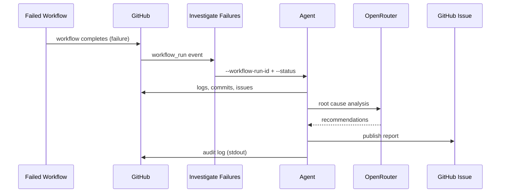
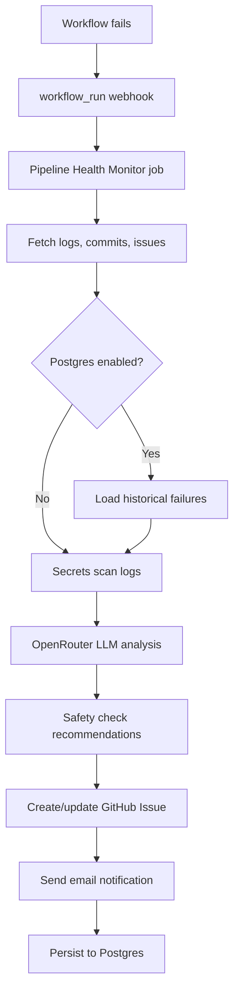

# Pipeline Health Monitor

Production-ready AI agent that automatically investigates GitHub Actions workflow failures.

## Version 1 Behavior

When **any** workflow in this repo fails:

1. GitHub fires a `workflow_run` event (`conclusion: failure`)
2. The **Investigate Failures** workflow starts (`.github/workflows/investigate-failures.yml`)
3. It invokes the agent with the workflow run ID:
   ```bash
   pipeline-agent --workflow-run-id 123456789 --status failure
   ```
4. The agent (target: **60–90 seconds**):
   - Fetches logs and run metadata (parallel job log downloads)
   - Analyzes recent commits
   - Searches GitHub issues for similar errors
   - Optionally loads historical failures from Postgres
   - Calls OpenRouter LLM for root-cause analysis
   - Generates a Markdown report
   - Stores audit events (and Postgres history if enabled)
   - Creates/updates a GitHub issue
   - Emails the triggering user + configured recipients
5. Developer reads the issue/email and fixes the problem



## Architecture



## Features

| Feature | Description |
|---------|-------------|
| **Auto-trigger** | Runs on any `workflow_run` completion (failures always; successes optional) |
| **Evidence gathering** | Logs, failed job/step details, recent commits, similar issues |
| **LLM analysis** | OpenRouter only — root cause, explanation, actionable fixes |
| **GitHub Issues** | Creates or updates labeled issues with full Markdown report |
| **Email** | Notifies trigger actor + configured recipients |
| **Postgres (optional)** | Stores investigation history on GCP for dedup and context |
| **Secrets scanning** | Redacts tokens/keys from logs and reports before publishing |
| **Audit logging** | Structured JSON events to stdout |
| **Rate limiting** | Daily investigation cap, per-run LLM call limit, deduplication |
| **Safety** | Destructive commands flagged for human approval only |

## Quick Start

### 1. Add secrets to your repository

| Secret | Required | Description |
|--------|----------|-------------|
| `OPENROUTER_API_KEY` | Yes | OpenRouter API key |
| `POSTGRES_DSN` | No | GCP Postgres connection string |
| `SMTP_USER` | No | SMTP username |
| `SMTP_PASSWORD` | No | SMTP password |

`GITHUB_TOKEN` is provided automatically by GitHub Actions.

### 2. Configure repository variables (optional)

| Variable | Default | Description |
|----------|---------|-------------|
| `OPENROUTER_MODEL` | `anthropic/claude-3.5-sonnet` | LLM model via OpenRouter |
| `POSTGRES_ENABLED` | `false` | Enable Postgres persistence |
| `EMAIL_ENABLED` | `false` | Enable email notifications |
| `SMTP_HOST` | — | SMTP server hostname |
| `SMTP_FROM` | — | From address |
| `EMAIL_RECIPIENTS` | — | Comma-separated fallback recipients |
| `NOTIFY_ON_SUCCESS` | `false` | Send brief success summaries |
| `MAX_INVESTIGATIONS_PER_DAY` | `50` | Daily LLM investigation cap |
| `MAX_LLM_CALLS_PER_RUN` | `2` | LLM calls per workflow run |
| `DEDUPE_WINDOW_HOURS` | `24` | Skip duplicate error investigations |

### 3. Deploy

The workflow `.github/workflows/investigate-failures.yml` runs automatically on every failed workflow.

## CLI (local or manual runs)

```bash
pipeline-agent --workflow-run-id 123456789 --status failure
```

Or via environment:

```bash
export WORKFLOW_RUN_ID=123456789
export WORKFLOW_RUN_STATUS=failure
pipeline-agent
```

## Permissions

The workflow uses least-privilege permissions:

```yaml
permissions:
  contents: read    # Read commits and repo metadata
  issues: write     # Create/update investigation issues
  actions: read     # Read workflow runs and logs
```

No write access to code, packages, or deployments.

## Local Development

```bash
pip install -e ".[dev]"

export GITHUB_TOKEN=ghp_...
export GITHUB_REPOSITORY=owner/repo
export OPENROUTER_API_KEY=sk-or-v1-...

pipeline-agent --workflow-run-id 123456789 --status failure
```

## Cost Controls

Designed for 100+ pipeline runs/day:

- **Daily cap**: `MAX_INVESTIGATIONS_PER_DAY` prevents runaway LLM costs
- **Per-run limit**: 1 LLM call per failure investigation
- **Dedup**: Same error fingerprint within 24h is skipped
- **Log truncation**: 80K chars fetched, 40K sent to LLM
- **Parallel fetches**: Job logs, commits, and issue search run concurrently
- **Job timeout**: 3 minutes hard cap; warns if over 90s

## Security

- Secrets are scanned and redacted before LLM calls and publishing
- Destructive commands (`kubectl delete`, `terraform destroy`, etc.) are flagged, never auto-executed
- All actions emit structured audit logs (stderr + JSONL files)
- See [SECURITY_CHECKLIST.md](SECURITY_CHECKLIST.md) for the full security review checklist

## Project Structure

```
pipeline_agent/
├── config.py              # Pydantic settings from environment
├── logging_conf.py        # stderr logging (stdout reserved for JSON)
├── security.py            # Secrets scanner + destructive command detection
├── agent_investigator.py  # Main orchestrator + public API
├── main.py                # CLI entry point
├── github_client.py       # GitHub API orchestration
├── openrouter_client.py   # OpenRouter LLM client
├── report_generator.py    # Markdown reports
├── audit_logger.py        # Structured audit events
├── safety.py              # Destructive command patterns
├── models/
│   ├── investigation_result.py
│   └── audit_log.py
├── tools/
│   ├── github_tools.py    # Read-only: logs, commits, issues
│   ├── postgres_store.py  # Optional GCP history
│   ├── notifications.py   # Email + GitHub issues
│   ├── secrets_scanner.py
│   └── rate_limiter.py
├── llm/                   # OpenRouter prompts and client
└── agent/                 # Optional LangChain bind_tools loop
```

### Core GitHub Tools (§3.1)

| Original snippet | Production tool | Improvements |
|------------------|-----------------|--------------|
| `get_workflow_logs` | `GitHubTools.get_workflow_logs()` | Zip logs, parallel downloads, error excerpts + last 50 lines |
| `analyze_recent_commits` | `GitHubTools.analyze_recent_commits()` | Time-window lookback, parallel file-change fetch per commit |
| `search_similar_issues` | `GitHubTools.search_similar_issues()` | GitHub Search API, solution hints from closed issue comments |

`GitHubClient.collect_context()` calls all three in parallel and feeds structured + formatted summaries to the LLM.

### LLM Setup (§4) — OpenRouter ONLY

```python
from pipeline_agent.llm.openrouter import get_llm  # No OpenAI fallback

llm = get_llm(
    api_key=os.environ["OPENROUTER_API_KEY"],
    model_name="anthropic/claude-3.5-sonnet",
)
```

| Mode | Env | Behavior |
|------|-----|----------|
| **Direct** (default, V1 fast path) | `USE_LANGCHAIN_AGENT=false` | Tools run first, single OpenRouter call with your strict output format |
| **Agent** | `USE_LANGCHAIN_AGENT=true` | OpenRouter + `bind_tools` loop with 3 GitHub tools, max 3 iterations |

Output format enforced by `INVESTIGATION_SYSTEM_PROMPT`:

```
**Root Cause**: ...
**Evidence**: ...
**Recommendation**: ...
**Risk Level**: Low | Medium | High
**Requires Human Approval**: Yes/No
**Suggested Commands**: ...
**Related Issues / References**: ...
```

## License

MIT
